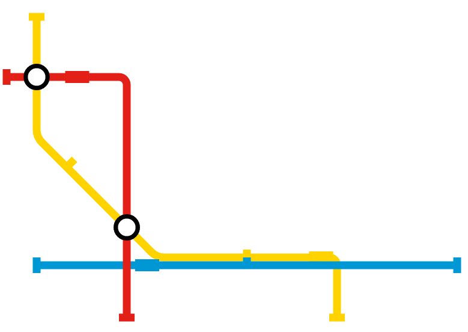

MetroJS
========

I got a bit carried away learning some HTML5 Canvas animation, and this is the result:

A live demo showing the animation can be found [here](https://metro.bede.io). I've set some relatively sane
defaults like pausing at each station for a second (i.e. 60 frames) but this is pretty easily changeable.

It's using a slightly modified version of my [canvas paths wrapper](https://github.com/bedekelly/canvaspaths).
I've added some helper methods for getting specific info at points, which will eventually make it back into
the wrapper's repository.

Todo:

* Add a `line.addRoute` method, probably using the car's "reverse" property.
* Make stations clickable!
* Add new routes and cars!
