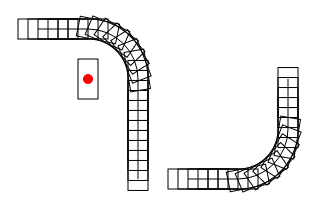

Canvas Paths
=============

**A rectangle's progression around a path:**

Canvas paths -- i.e. the `Path2D` object -- don't have the flexibility of SVG paths for common animation tasks like finding the coordinates of a point at a distance along the path.

This Path object should provide a handy wrapper for the `Path2D` object which stores information about the path so that it can provide these features.

It will have all the methods like `arc`, `lineTo`, etc. of a regular Path2D object, and the 
underlying Path2D object will be available by accessing the `_path2d` attribute.

However it will also provide the `getInfoAtDistance` method, which gives the X and Y values
of a point along the line, as well as an angle corresponding to the gradient of the tangent
to the line at that point. This is invaluable for animating shapes moving "around" a path,
e.g. trains moving along a track.

A PathFollower object is also provided, which creates a single-use iterable object to find
information about the points at incrementally greater distances. This provides just two
methods: `advance(distance)` and `getInfo()`. This is useful for animating a shape's motion
along a particular path.

Tests are provided in `tests.html`; please see the source comments for advice on where to
put breakpoints in order to see each test succeed.
